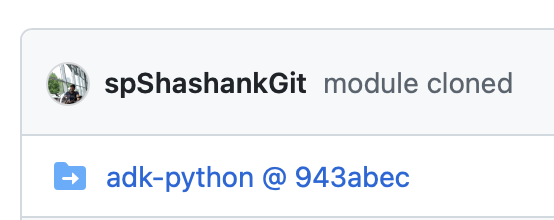

# Readme

Clone the submodule
```console
git submodule add git@github.com:google/adk-python.git
```
Result: You should be able to see this icon on github.
And inside the submodule folder all the files should be cloned corresponding to the version you cloned. In this case @943abec.
